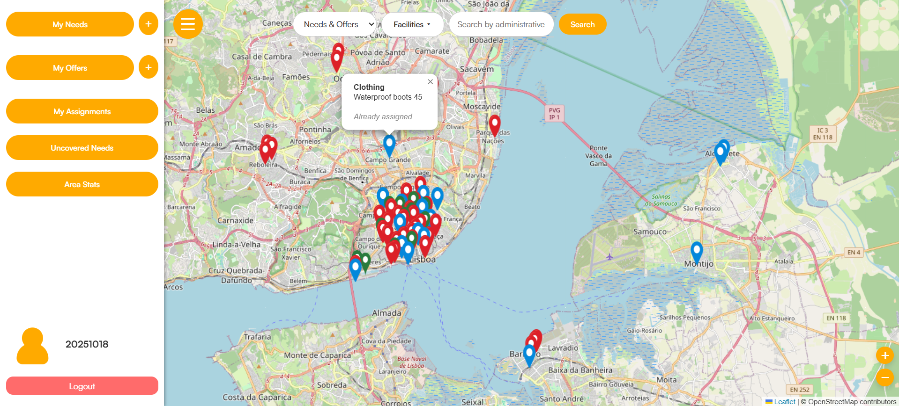
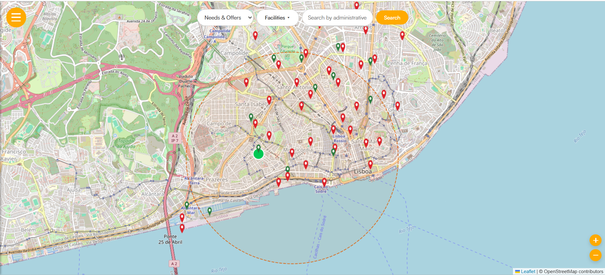
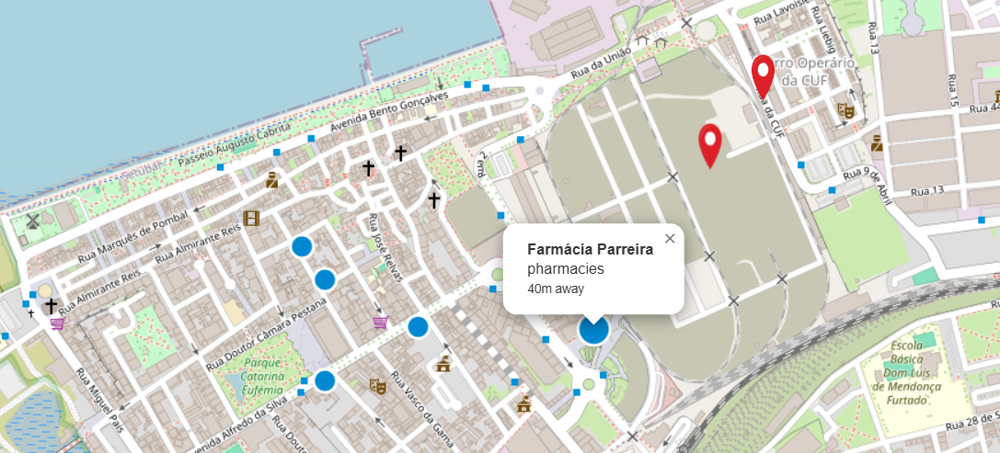
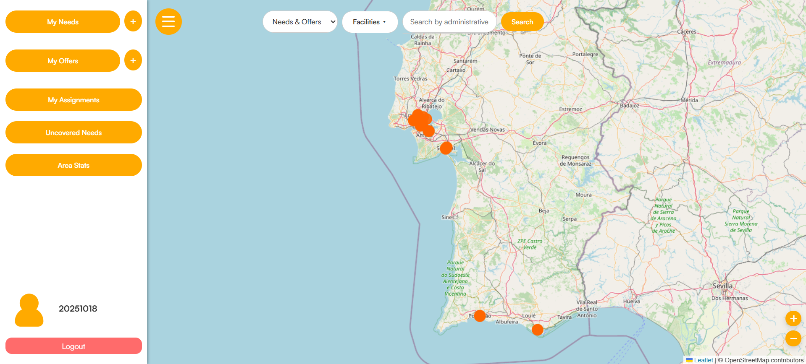
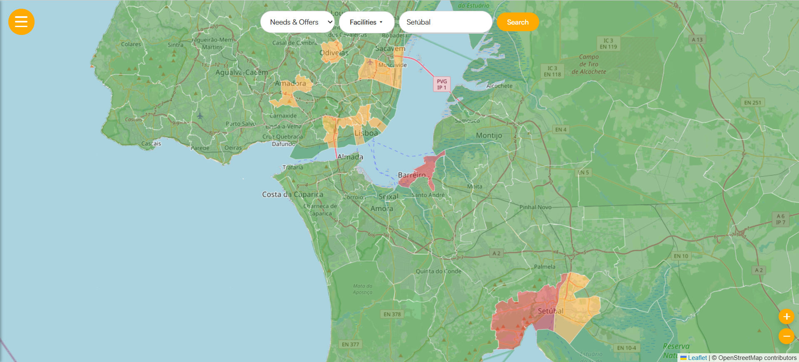
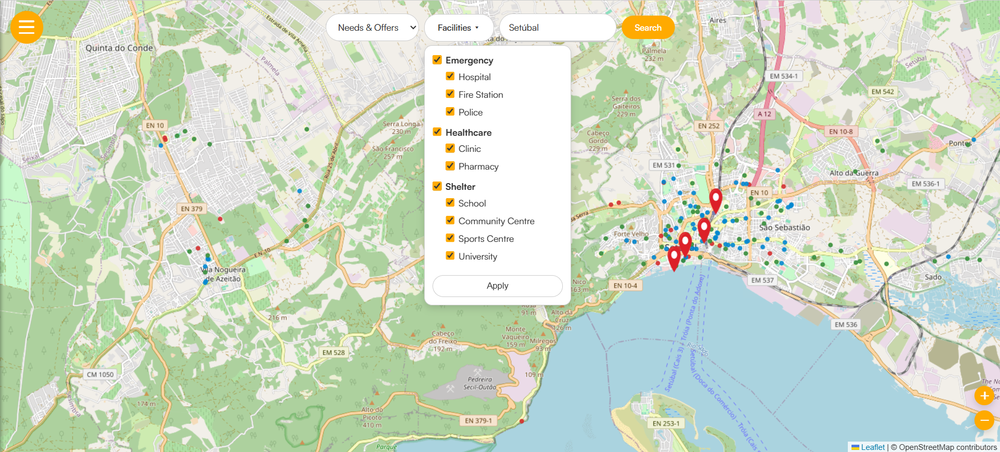

# Community Hazard Response Platform

A platform designed to coordinate community responses to local hazards and emergencies. It enables real-time reporting, resource allocation, and communication between residents, volunteers, and emergency services.

🌐 **Live demo:** [community-hazard-response-platform.onrender.com](https://community-hazard-response-platform.onrender.com)

---

## What It Does

During a hazard or emergency, people need help and volunteers want to offer it — but there is no easy way to connect them. This platform solves that by letting users:

- **Post needs** — request help with food, transport, medical supplies, shelter, and more
- **Post offers** — volunteer availability and resources to share
- **Get matched** — the platform links needs to offers by category and proximity
- **Track response** — assignments move through a lifecycle from proposed to completed
- **See the map** — all needs, offers, and emergency facilities are shown on an interactive map, with spatial filters by administrative area

Reference data (administrative boundaries and emergency facilities) is kept up to date automatically by the ETL pipeline.

---

## Table of Contents

- [Features](#features)
- [Architecture](#architecture)
- [Requirements](#requirements)
- [Installation](#installation)
- [Module Documentation](#module-documentation)
- [Deployment](#deployment)
- [Authors](#authors)
- [License](#license)

---

## Features

### Interactive Map

All needs (red pins) and offers (green pins) are displayed on a live Leaflet map. Assigned needs appear in blue. Clicking any marker opens a popup with full details — and if you're a volunteer, an **Accept** button to take on the need directly.

The sidebar gives each user a personal view of their activity: submitted needs and offers, active assignments, and quick **+** buttons to create new ones.



---

### Nearby Offers — Proximity Radius

Clicking a need on the map draws a dashed **2 km radius circle** and highlights matching offers by proximity: bright green circles are within range. The closest offer is shown largest.



---

### Nearest Facilities

From any need popup, clicking **Nearby Facilities** surfaces the closest relevant emergency infrastructure — automatically filtered by the need's category (e.g. a medical need returns hospitals, clinics and pharmacies). The nearest result opens its popup automatically and shows the distance in metres.



---

### Uncovered Needs

The **Uncovered Needs** button highlights all active needs with no matching offer within 2 km. An alert reports the total count and how many are critical. Useful for coordinators scanning for gaps across a wide area.



---

### Area Statistics — Choropleth Map

**Area Stats** switches the map to a choropleth view. Each municipality or parish is coloured by its **gap score** (active needs minus active offers): red means high unmet demand, amber is moderate, green is covered. Clicking any polygon shows the exact need count, offer count and gap for that area.



---

### Facility Filter

The **Facilities** dropdown overlays real-world infrastructure from OpenStreetMap onto the map. Filter by Emergency (hospitals, fire stations, police), Healthcare (clinics, pharmacies) or Shelter (schools, community centres, sports centres, universities) — or any combination — and apply to see them as colour-coded dots alongside needs and offers.



---

### Area Search

The search bar supports **autocomplete by administrative area** (municipality or parish). Typing at least 2 characters fetches matching area names; selecting one filters the map to show only needs, offers and facilities within that area's boundaries using a spatial join.

---

### User Accounts

- Registration with **email verification** (bcrypt password hashing, secure token)
- Login / logout with session management
- Profile management: update username, email, name and phone
- Password reset and account deletion

---

### Assignments

Volunteers can accept a need directly from its map popup. If the volunteer has one matching offer, the assignment is created automatically; if they have several, they are prompted to choose. An **email notification** is sent to the other party on assignment creation. Completing an assignment marks both the need and offer as resolved — enforced by database triggers.

---

## Architecture

```
Community-Hazard-Response-Platform/
├── api/                  # Flask API — routes, auth, business logic
├── config/
│   ├── config.yml.example  # Shared configuration template
│   └── config.yml          # Local credentials (gitignored)
├── db/                   # PostgreSQL/PostGIS schema and seed data
├── docs/                 # Schema diagrams and documentation assets
├── etl/                  # ETL pipeline — CAOP and OSM data ingestion
├── frontend/             # HTML/CSS/JS templates served by Flask
├── environment.yml       # Shared Conda environment
└── README.md
```

The three backend modules share a single PostgreSQL/PostGIS database and a single configuration file:

```
                    ┌─────────────┐
                    │  config.yml │
                    └──────┬──────┘
           ┌───────────────┼───────────────┐
           ▼               ▼               ▼
       ┌───────┐      ┌─────────┐     ┌─────────┐
       │  etl  │      │   api   │     │   db    │
       └───┬───┘      └────┬────┘     └────┬────┘
           │               │               │
           └───────────────│───────────────┘
                           ▼
                    ┌──────────────┐
                    │  PostgreSQL  │
                    │  + PostGIS   │
                    └──────────────┘
```

- **db** — defines the schema: tables, spatial indexes, triggers and seed data
- **etl** — populates the reference layers (`administrative_area`, `facility`) from CAOP and OpenStreetMap
- **api** — serves the frontend and exposes all endpoints; reads and writes user-generated data (needs, offers, assignments)

---

## Requirements

- [Conda](https://docs.conda.io/en/latest/miniconda.html)
- PostgreSQL 14+ with the [PostGIS](https://postgis.net/install/) extension
- A Gmail account with an [App Password](https://support.google.com/accounts/answer/185833) (for email verification)

---

## Installation

### 1. Clone the repository

```bash
git clone https://github.com/Community-Hazard-Response-Platform/Community-Hazard-Response-Platform.git
cd Community-Hazard-Response-Platform
```

### 2. Create the Conda environment

```bash
conda env create -f environment.yml
conda activate hazard_response_platform
```

### 3. Configure credentials

Copy the config template and fill in your details:

```bash
cp config/config.yml.example config/config.yml
```

Edit `config/config.yml`:

```yaml
database:
  host: "localhost"
  port: "5432"
  database: "hazard_response_db"
  username: "your_username"
  password: "your_password"

email:
  address: "your_email@gmail.com"
  password: "your_gmail_app_password"
```

> `config/config.yml` is gitignored — your credentials will not be committed to version control.

### 4. Set up the database

Create the database and run the schema:

```bash
psql -U your_username -h localhost -c "CREATE DATABASE hazard_response_db;"
psql -U your_username -h localhost -d hazard_response_db -f db/model.sql
```

Optionally load seed data for development:

```bash
# Base data: users, categories, needs, offers and assignments in Lisbon
psql -U your_username -h localhost -d hazard_response_db -f db/model_inserts.sql

# Storm scenario: adds Storm "Aura" data across Portugal (requires model_inserts.sql first)
psql -U your_username -h localhost -d hazard_response_db -f db/storm_inserts.sql
```

### 5. Run the ETL pipeline

Fetches and loads Portuguese administrative boundaries (CAOP) and emergency facilities (OpenStreetMap) into the database:

```bash
python etl/run_etl.py
```

> This step requires an internet connection and may take a few minutes. The ETL only needs to be re-run when you want to update the reference data.

### 6. Start the API

```bash
python api/run_api.py
```

The platform will be available at **http://localhost:5000**.

---

## Module Documentation

Each module has its own README with full details:

- [`db/README.md`](db/README.md) — schema, tables, triggers, seed data
- [`etl/README.md`](etl/README.md) — pipeline stages, configuration, module reference
- [`api/README.md`](api/README.md) — endpoints, auth flow, connection pool

---

## Deployment

The platform is deployed on [Render](https://render.com). When `config/config.yml` is not present, the API falls back to environment variables:

| Variable | Description |
|---|---|
| `DB_HOST` | Database host |
| `DB_PORT` | Database port |
| `DB_NAME` | Database name |
| `DB_USER` | Database username |
| `DB_PASSWORD` | Database password |
| `EMAIL_ADDRESS` | Sender email address |
| `EMAIL_PASSWORD` | Gmail App Password |
| `FLASK_SECRET_KEY` | Secret key for session signing |

---

## Authors

- [Ricardo Sales Piquer](https://github.com/ricardosp4)
- [Andrea Belen Cretu Toma](https://github.com/al415615)

## License

This project is licensed under the [GPL-3.0 License](LICENSE).
